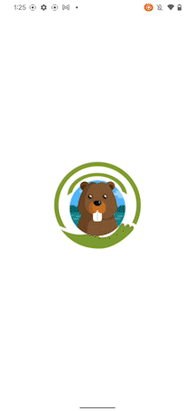
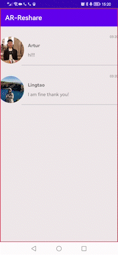

# AR Reshare App

### An augmented-reality enabled application allowing people to share the goods, gifts and food they no longer need or want.

The app allows a contributor to list an item they would like to share for free along with their postcode. A consumer can either search for an item or they can find items in their local area via an Augmented Reality interface. The consumer can then get in touch with the contributor and arrange a pickup. This project was developed by a team of **University of Bristol** students in collaboration with **Durham University**.

 

 

## Table of Contents
1. [About](#ar-reshare-app)
2. [Getting Started](#getting-started)
   * [Prerequisites](#prerequisites)
   * [Setup and Build](#setup-and-build)
   * [Running the Application](#running-the-application)
2. [Backend Deployement](#backend)
3. [License](#license)
4. [Contact](#contact)

 

# Getting Started

## Prerequisites
* Android Studio (available to download [here](https://developer.android.com/studio)), and
* Android Device with **API Level 27 (8.1 Oreo) or above**, or
* Computer capable of running the [Android Emulator](https://developer.android.com/studio/run/emulator)

**Note: To use the AR functionality the Android Device must be AR Compatible. Here is the list of [currently supported devices](https://developers.google.com/ar/devices).**

## Setup and Build

In Android Studio
1. Go to *File > Open...* and choose the location of the project.
2. Select *Trust project* and wait for Gradle sync to be finished.
3. In the tool bar, select *Build > Make Project*.
4. In the tool bar, select *Run > Edit Configurations*. Ensure that the module is selected to be *AR-Reshare.app* and that the Launch Activity is specified to *Default Activity*.

## Running the Application
To run the application on an emulated Android Device:
1. In Android Studio, select *Run > Select Device... > AVD Manager*.
2. Select *Create Virtual Device* and choose one of the devices available. 
3. Select Android System with **API Level 27 (8.1 Oreo) or above**.
4. Once the installation is complete, select your new emulated device and go to *Run > Run 'app'*.

To run the application on a physical Android Device:
1. Go to *Settings > About Phone > Build Number* and repeatedly press *Build Number* to enable the [*Developer Options*](https://developer.android.com/studio/debug/dev-options).
2. Connect the Android device to your computer.
3. Choose to *Trust the Computer* and give all necessary permissions.
4. In Android Studio, select *Run > Select Device...* and choose your device.
5. Now select *Run > Run 'app'* to install and run the application directly on your device.

# Backend Deployement
The backend for this application has been developed by the team from **Durham University**. You may find the API docs [here](https://ar-reshare.herokuapp.com/) and the repository containing the backend source code [here](https://github.com/AR-Reshare/AR-Reshare).

# License
This project has been licensed under the [**MIT License**](https://github.com/spe-uob/2021-ARReshare/blob/main/LICENSE)

# Contact
For contact and queries about contributing to the project, please email grp-ar-reshare@groups.bristol.ac.uk.
