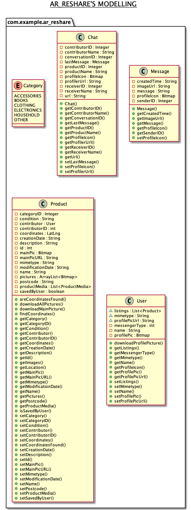
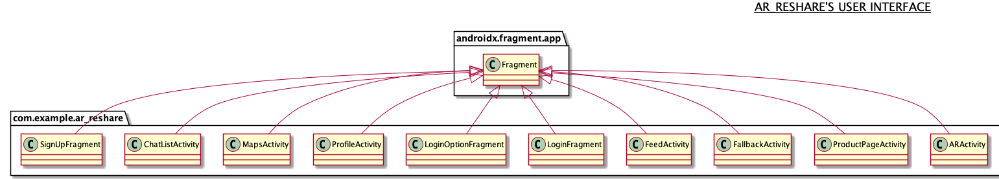
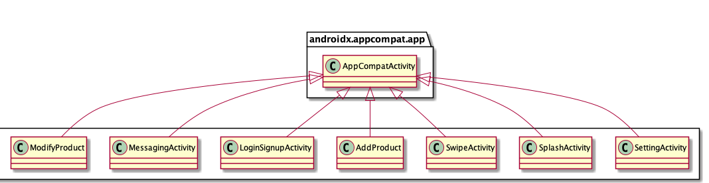
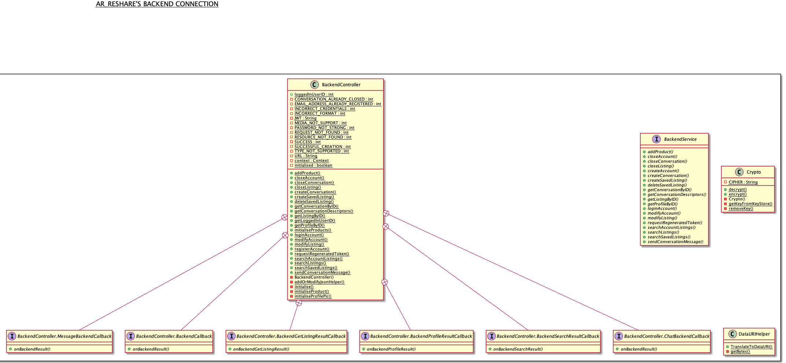
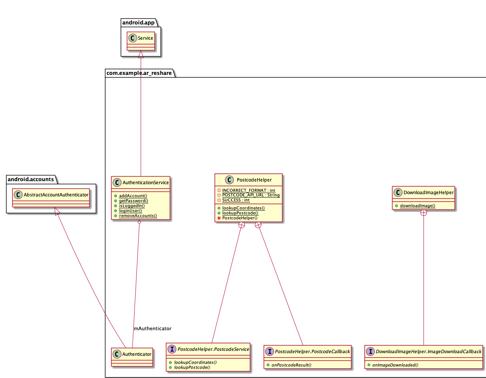

# AR Reshare Architecture

### This file contains diagrams and descriptions relating to the different components of our application.

# AR Reshare Modelling

These are the classes we used to model the objects of our application. These reflect the way they are stored on the Backend. Category is an Enum Class and the rest are classes that have the required attributes in order to interact successfully with the Backend. We use getters and setters for each in order to keep our code as tidy as possible. 

# AR Reshare User Interface

Our User Interface is a mix of fragments and activities. This is because the different pages that are a part of the in-app navigation bar are fragments, along with the signup/login page and product page. A note to make here is the FallbackActivity which shows up instead of the ARActivity, in the case that AR is not supported by the user's device. The rest of them are activities. 
 

# AR Reshare Backend Connections

As our Backend was written up by *Durham University*, we had to integrate it with our frontend. 

Our Backend connections were made through Retrofit. We have the BackendService interface that defines all the methods required. We then implement these methods in the BackendController, as outlined by our [API specification](https://ar-reshare.herokuapp.com/#/). The BackendController also contains global variables such as the error constants, the JWT token of the logged in user and their id. We also have a DataURI Helper that converts the URI of the picture(s) uploaded by the user to dataURI which is required by the backend. 

Other function helpers include the PostcodeHelper which looks up coordinates and returns a postcode, and the DownloadImageHelper which downloads a picture stored in the cloud by the Backend, to the local device. 

